# 一、项目概述
一个适用python语言开发的基于openlist搭建的视频播放平台,基于 Flask 的视频管理系统，支持通过 OpenList 管理视频文件，提供首页视频浏览、抖音式短视频播放、系列合集、分类管理等功能。
工作流程：OpenList/Alist挂载网盘，本程序直接获取OpenList/Alist视频链接，从而播放视频
### 技术栈

| 层级 | 技术 |
|------|------|
| 后端框架 | Flask 3.x (Python 3.12+) |
| 数据库 | SQLite |
| 前端 | Bootstrap 5 + Jinja2 模板 |
| 视频播放 | Video.js / HLS.js |
| 文件存储 | OpenList (AList 兼容) |
| 元数据解析 | NFO 文件 (XML 格式) |

### 运行环境

- Python 3.12+
- 依赖: `flask>=3.0.0`, `requests>=2.31.0`
- 端口: 3090
- 启动命令: `python run.py`
- 默认账号: `admin / password`
- 可在Windows、Linux、MAC等系统环境部署

# 二、部署说明（以wWindows系统为例）

### 安装Python
- 3.12.0以上版本，安装方式略，不会的自行搜索安装
### 依赖安装
- 将项目的“video_site”文件夹整个克隆到本地电脑，在命令行工具中定位到文件夹或直接在文件夹中通过右键打开命令行工具。
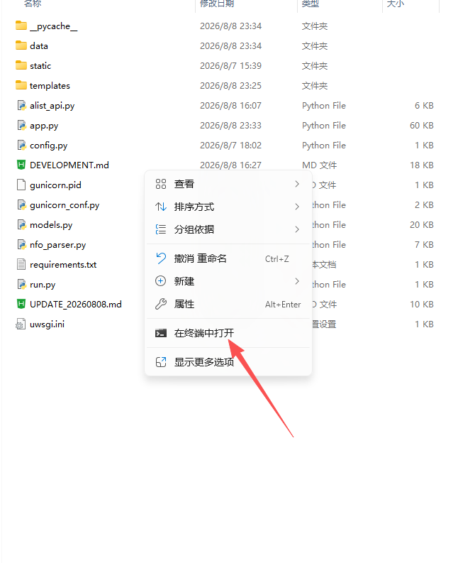
- 在命令行工具中输入“pip install -r requirements.txt”命令安装依赖，如依赖安装过程报错，自行利用搜索工具解决。
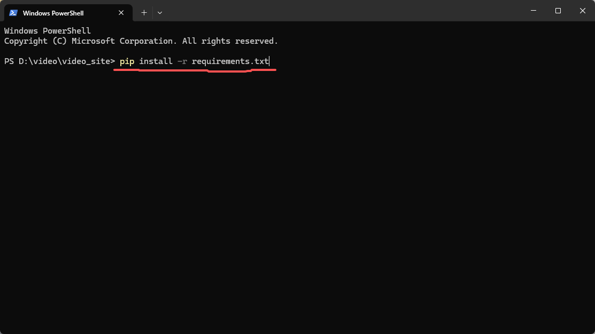
### 启动项目
- 运行环境部署完成后双击目录中的“run.py”启动程序，然后会自动打开一个命令行窗口，正常情况如下图，里面有网页地址和用户名及密码等信息，在浏览器中输入“本机IP:3090”即可打开网页，使用用户名admin，密码password登录。
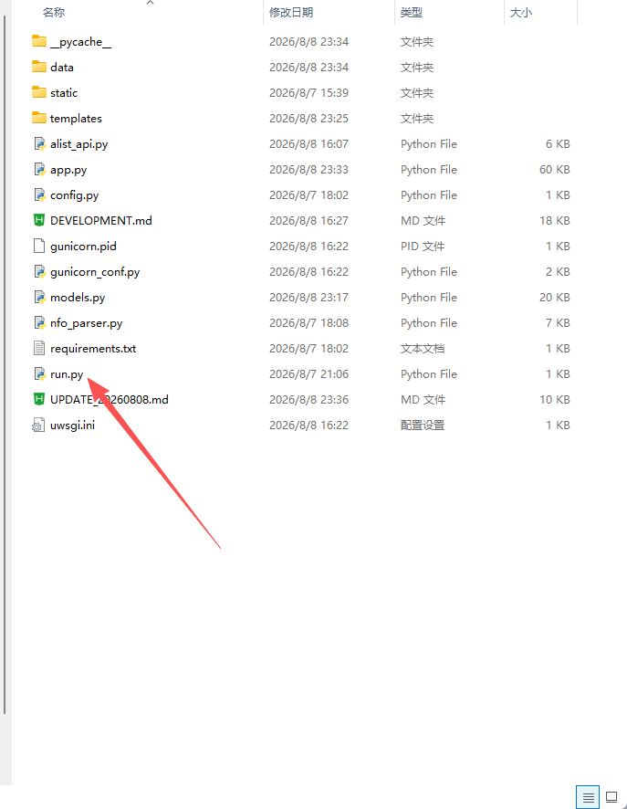
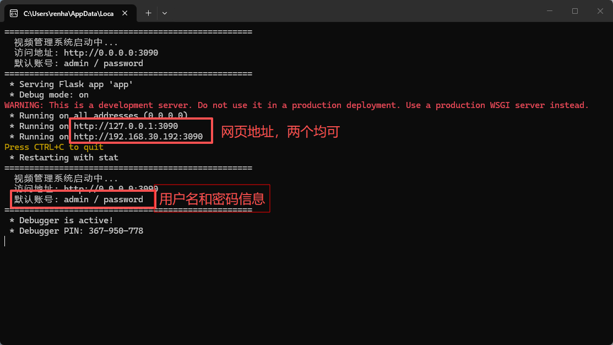
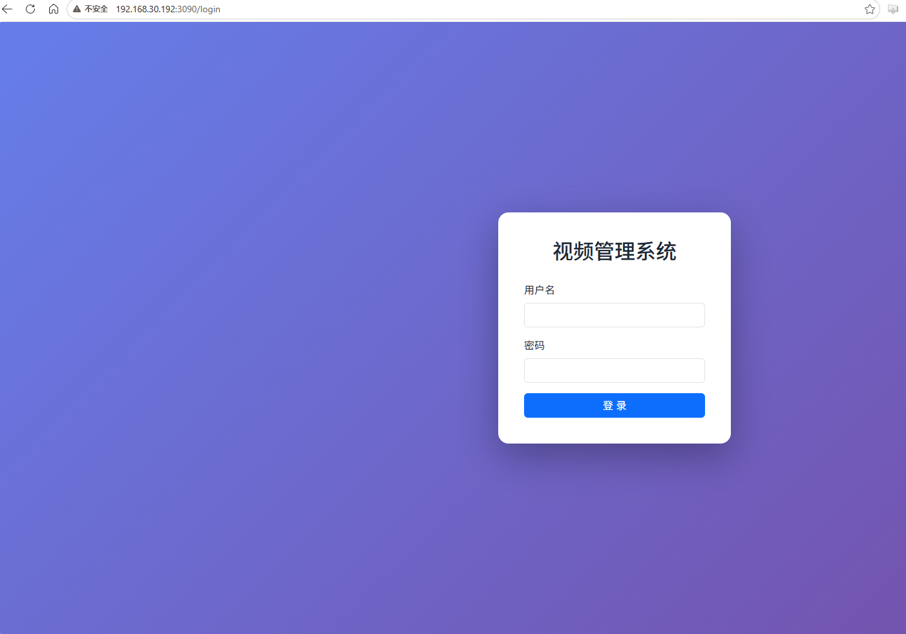
### 附一张宝塔面板设置的截图，有使用宝塔面板的照着抄就行了，项目路径要换成“video_site”的实际路径
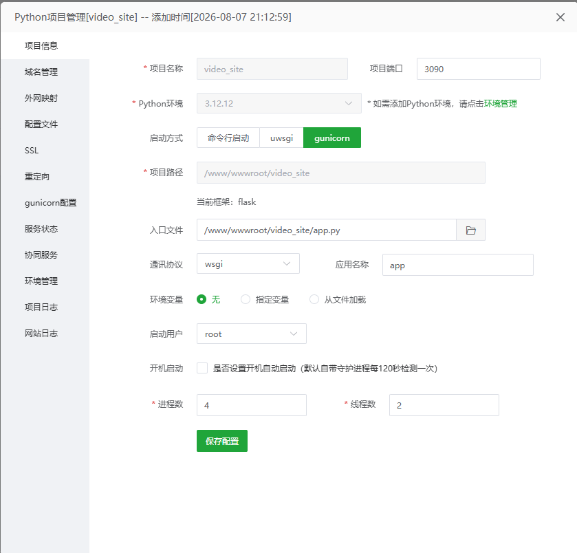

# 三、功能介绍
### 前端功能简介
#### 视频播放
- 首页 正常电影、电视剧列表，可根据分类筛选
- 短视频 类似于某音那样播放短视频的，上下滑动切换视频，两个模式分别独立，数据隔离，互不干扰
#### 后台管理
- 仪表盘 视频信息汇总显示
- 视频管理 对应首页的视频数据，编辑、删除已导出的视频
- 短视频管理 对应短视频的数据，编辑、删除已导入的短视频
- 分类管理 对应首页的分类，编辑、删除分类
- 短·分类管理 对应短视频的分类，编辑、删除分类
- 系列管理 主要针对电视剧，多集创建系列，在首页中
- OpenList管理 项目心脏，下面单据介绍
### 项目心脏：OpenList/Alist挂载网盘视频直接导入
- 登录后点击“后台管理”→“OpenList管理”
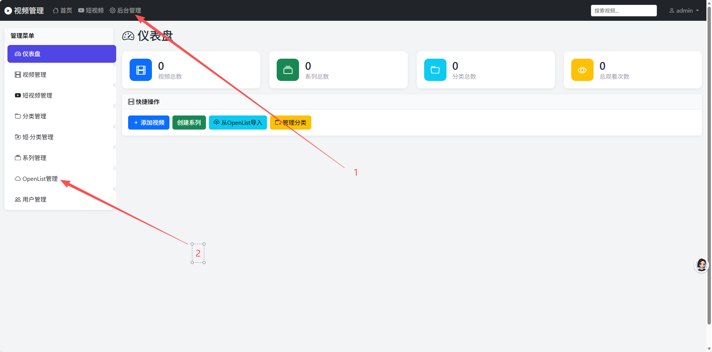
- 添加帐号，输入自己的OpenList或Alist地址和用户密码，输入后可以先测试下是否能连通，如果没问题点击“添加”按钮，这样账户就设置好了
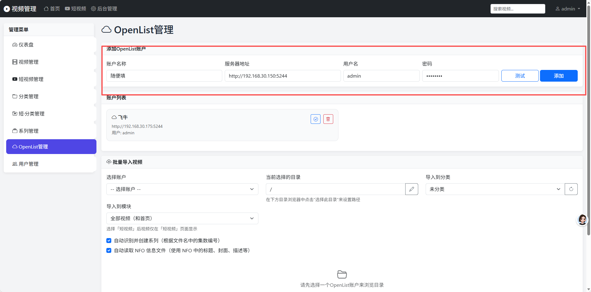
- 导入视频：在批量导入视频区域先选择已经添加的OpenList/Alist账户，然后会加载出挂载的网盘列表，直接在网盘列表中打开要导入的视频目录。“导入到模块”一共有两个选项，“全部视频”为导入到首页，“仅短视频模块”导入为短视频，选择模块后导入分类选线会自动切换到对应模块的分类。文件列表右下角的“选择此视频”和“选择此目录”分别对应选择导入单个视频和导入目录中的全部视频，如目录中有.nfo刮削文件，会自动识别，图片名称中如包含“poster”字段，会将该图片自动设为视频封面，如果没有可手动选择目录中的图片作为封面；目录中有2个及以上视频文件时会按目录名称自动创建系列，选择导入短视频时不会创建系列。PS：可以先到分类管理中创建好分类再导入视频，方便管理
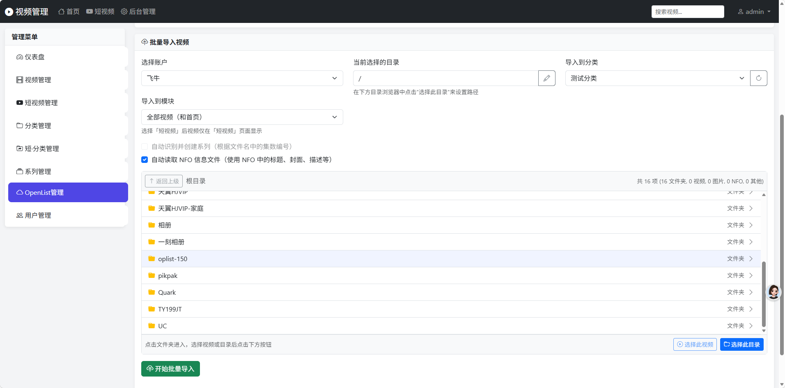
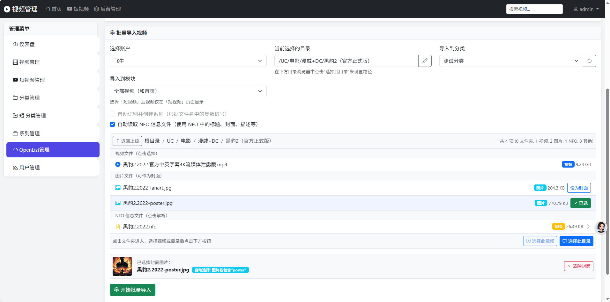
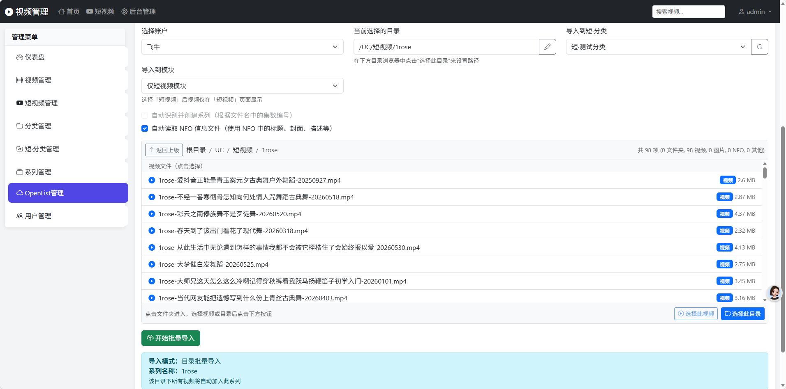
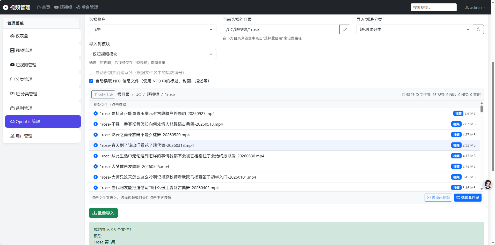
- 视频导入后的列表
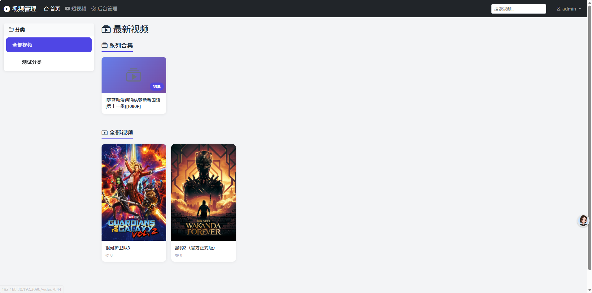
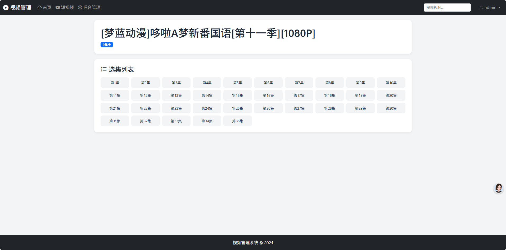
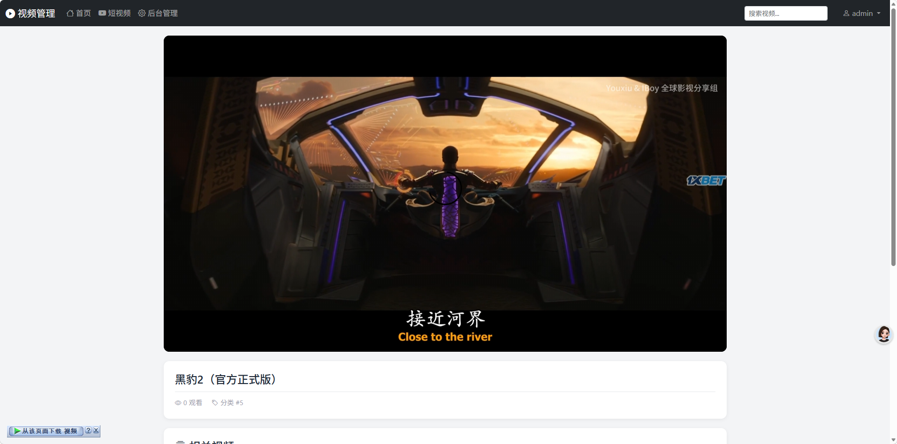
- 注：视频播放速度与网盘及宽带下行速率直接相关
### 核心功能：短视频播放
- 开发这个项目的初衷是因为收集的短视频资源太多，全部放到本地存储空间吃紧，于是萌生用网盘当短视频存储介质的想法，为此还开发了配套APP，个人刷短视频用，基本实现与某音同类效果，APP自行下载安装（仅有安卓版本）。
- APP安装后打开设置界面，在服务器地址处填写前面部署说明里程序启动后的前端地址，测试连通无误后保存即在APP中观看网页端添加的长短视频；短视频分类列表界面点击某个分看片仅播放该分类下的视频，点击全部卡片播放全部分类视频，每集播放完自动播放下一集，也可上下滑动屏幕切换，默认按视频导入顺序播放，最后导入的排在播放列表最前，右下角有随机顺序播放开关，开启后按随机顺序播放
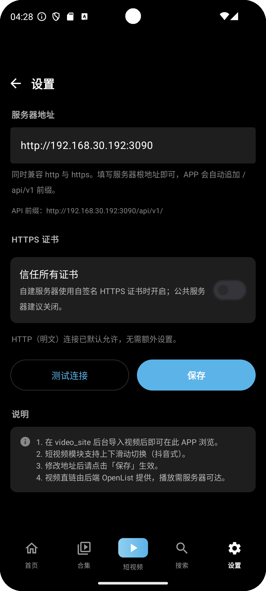

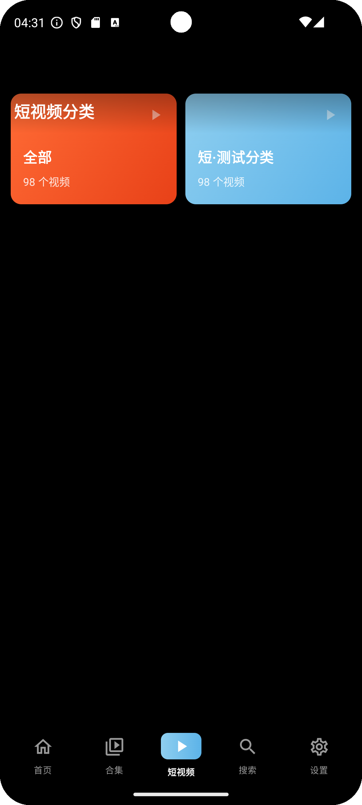

- APP有三个功能不太相同的版本，具体区分如下

| 安装包名称 | 区别 | 参考图 |
|------|------|------|
| app-release v1 | 短视频功能没有分类界面，点击底部导航栏按钮后直接进入短视频播放界面 | / |
| app-release v2 | 短视频功能有分类界面，点击底部导航栏按钮后进入短视频分类选择界面，选择分类后进入播放界面，播放界面左上方有返回分类界面按钮和分类切换功能 | 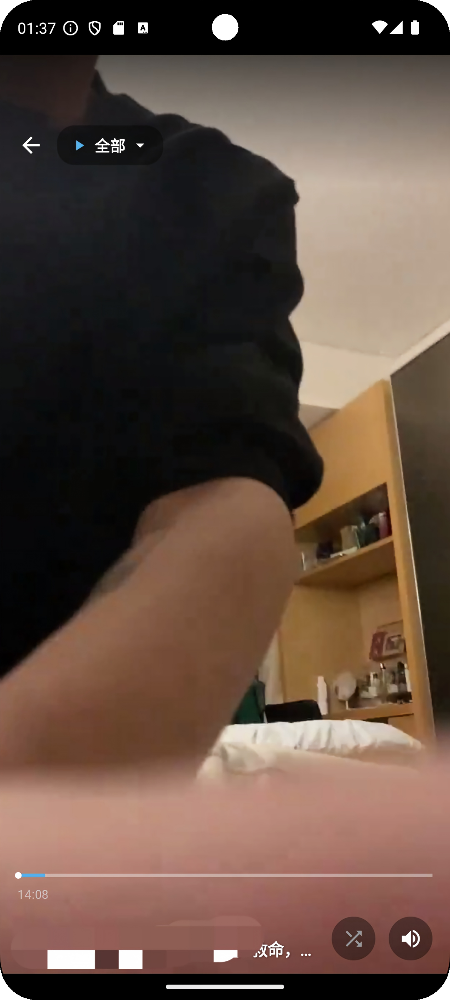 |
| app-release v3 | 与V2版本基本相同，取消短视频播放界面左上角返回按钮和分类切换选项，界面更加清洁 |  |

## 写在最后：本人不懂任何软件开发知识，感谢AI让我这个小白也能实现自己的定制需求，使用过程中有什么BUG可以提，我会反馈给AI，但是不一定能解决！！！
